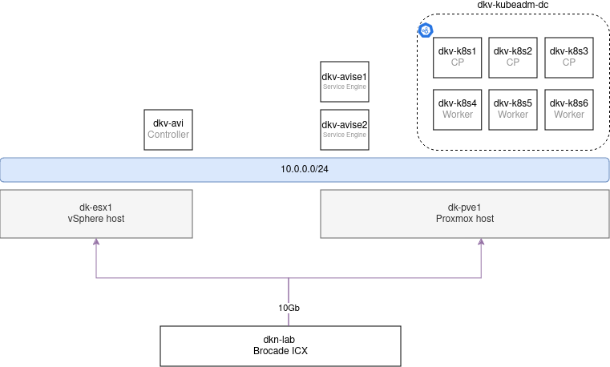
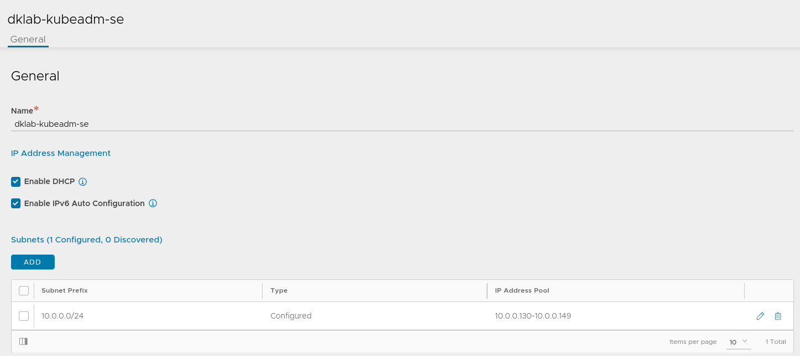

# Running AVI as a Layer 7 loadbalancer on vanilla kubernetes
Most of you will know about the integration of AVI Loadbalancer with NSX and VMware's WCP/TKG.  
In this page we will be deploying the AVI operator (AKO) on a kubeadm cluster to handle Layer 7 traffic.

## The setup
The high level topology looks like this:  

For the kubernetes part, we're running a 6 node kubeadm cluster (3 CP's, 3 workers) on Debian VM's on top of our Proxmox host.  
This cluster (__dkv-kubeadm-dc__) is running kubernetes version 1.30.1.  

On the AVI side of things, we are running our AVI controller on the vSphere host. The Service Engines (SE's) will be running on the Proxmox host next to the k8s cluster.
We will not cover the deployment of the AVI controller itself in this guide but any configuration required to get this working will be shown.

Everything communicates across a flat L2 10.0.0.0/24 network.

## Configuring the AVI Cloud
Firstly we'll configure our AVI Cloud in the AVI Controller. 
### Cloud
For this setup, we will use the Default Cloud that already comes with a newly deployed AVI controller. If you already use this cloud, you can simply create a new one.
The cloud type is going to be __No Orchestrator__. 

We will come back to this cloud once we've configured the IPAM and network.
### Network
We will need to define a network form which the SE's will pick IP's for loadbalancing.

Under _Infrastructure > Cloud Resources > Networks_, create a new network, give it a name and specify the IP range.
Keep "Use Static IP Address for VIPs and SE" enabled and add the IP range.

### IPAM
To complete our Cloud configuration, we need to create a new IPAM profile.  
Create a new template under _Templates > Profiles > IPAM/DNS Profiles_.  
Give it a name, select your cloud and add the Network you created in the previous step.

### Finish Cloud config
Go back and edit your Cloud. In the IPAM section, select your newly created IPAM profile. 

## Deploying the SE's
The previous steps were all pretty easy. Now comes the hard part: deploying Service Engines onto Proxmox.  
To deploy the SE's, you can either use the ansible role or pure API calls. In this case, I've used the Ansible role in combination with some manual steps.

## Deploying AKO on the kubeadm cluster

