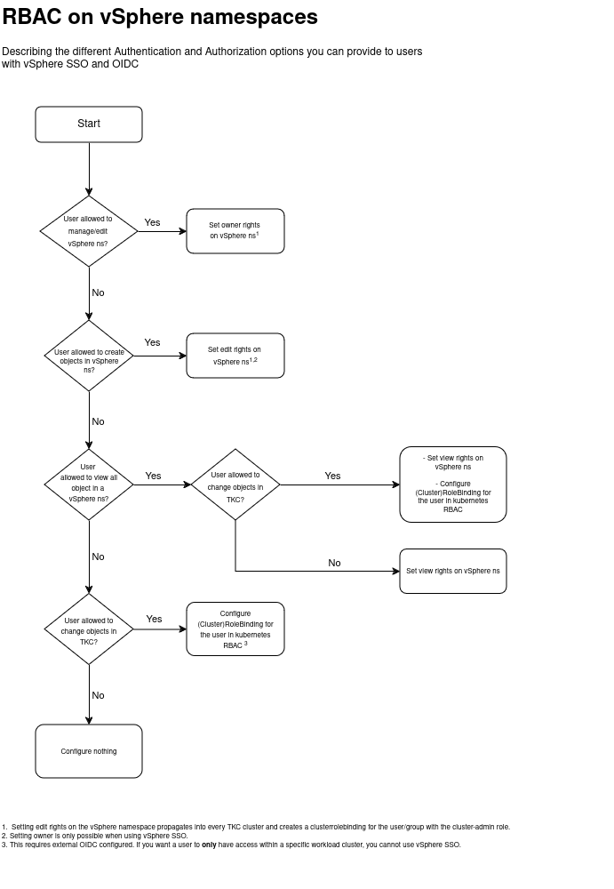

# Explaining RBAC on WCP and TKC guest clusters

WCP uses a concept of vSphere namespaces to organize workloads on the WCP control plane.  
vSphere namespaces can be seen as a combination of vSphere resource pools and kubernetes namespaces. 

Part of the featureset of a vSphere namespace is to assign permissions to users and groups. These users can be authenticated against either the vSphere SSO or an external OIDC provider.

## vSphere namespace permissions
The vSphere namespace permissions tile handles both Authentication and Authorization for a given namespace. All child objects within the namespace will inherit the given permission set. This means you need to carefully assign permissions if you want different permission sets __within__ a namespace.

## Kubernetes RBAC
vSphere SSO and external OIDC can provide authentication but you will probably still need granular authorization within a guest cluster (tkc). This is where you will need to leverage the built-in kubernetes RBAC constructs with (cluster)rolebindings.

## Deciding what permissions you need.
Depending on what authentication method you use and the required permissions on a guest cluster or namespace, you will need to set specific permissions both in the vSphere UI and through kubernetes RBAC.

Below is a flowchart that guides you through the permissions and where to set them.

